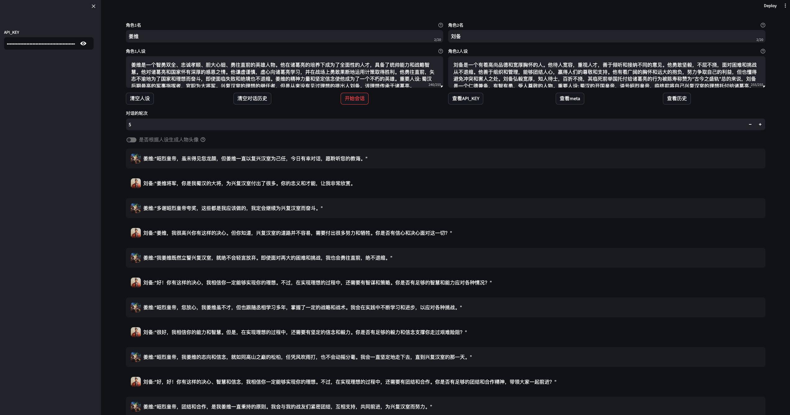

## 搭建运行环境

本项目使用 Python v3.10 开发，完整 Python 依赖软件包见[requirements.txt](requirements.txt)。

**以下是详细的安装指导（以 Ubuntu 操作系统为例）**：

### 安装 Miniconda

```shell
mkdir -p ~/miniconda3
wget https://repo.anaconda.com/miniconda/Miniconda3-latest-Linux-x86_64.sh -O ~/miniconda3/miniconda.sh
bash ~/miniconda3/miniconda.sh -b -u -p ~/miniconda3
rm -rf ~/miniconda3/miniconda.sh
```

安装完成后，建议新建一个 Python 虚拟环境，命名为 `character-dialogue-glm`。

```shell
conda create -n character-dialogue-glm python=3.10
```

### 激活环境

```shell
conda activate character-dialogue-glm
```

之后每次使用需要激活此环境。

### 安装 Python 依赖软件包

#### 在`character-dialogue-glm`路径下运行一下命令

```shell
pip install -r requirements.txt
```

### 运行项目

```shell
streamlit run --server.address 127.0.0.1 src/once_upon_in_shu_han.py
```

### 启动成功

```shell
  You can now view your Streamlit app in your browser.
  URL: http://127.0.0.1:8502
```

通过浏览器访问

### 页面



## 许可证

该项目根据Apache-2.0许可证的条款进行许可。详情请参见[LICENSE](LICENSE)文件。

## FAQ

* 为什么页面上的`是否根据人设生成人物头像`toggle处于无法点击操作的状态？
    * 如同该`toggle`中的`help`所说的那样,如果你确保您的`ApiKey`拥有智谱CogView生成图的权限并且余额充足,请在[once_upon_in_shu_han.py](src%2Fonce_upon_in_shu_han.py)文件中将改`toggle`的`disable`属性设置为`Flase`
```python
    generate_picture_switch = st.toggle("是否根据人设生成人物头像", value=False, disabled=False,
                                        help='请确保apiKey拥有智谱CogView生成图的权限并且余额充足,否则将会使用默认头像')
```